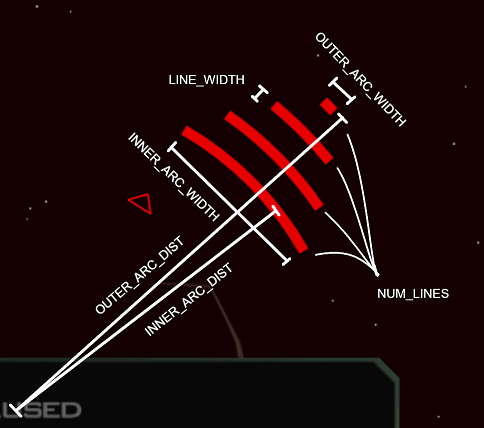

# Directional Damage Indicator
This will cause a pulsing colored arc centered on the reticle to briefly indicate the direction the player took damage, with the arc getting wider if the attack was more to the front/back. It's usage can be seen in Blighted's gameplay trailer: https://www.youtube.com/watch?v=1DohgKt7WxU

## Parameters
There are several ways to customize the look and behavior of 'damage arcs' at the very top of the script:
| Variable | Description |
| -- | --|
| ``ARC_FLASH_RATE`` | The rate in seconds the arc flashes |
| ``ARC_COLOR`` | The color of the arc; (0-255, 0-255, 0-255) |
| ``FADE_FORWARD_FACING_ARCS`` | Controls whether arcs should fade away if the attack comes from the front (i.e. you totally saw it happen anyway) |
| ``ARC_DURATION`` | How long an arc persists; seconds. |
| ``NUM_LINES`` | How many individual lines make up an arc. |
| ``LINE_WIDTH`` | The width of each line; pixels. |
| ``INNER_ARC_WIDTH`` | How wide the 'base' of the arc, closer to the reticle, is. |
| ``OUTER_ARC_WIDTH`` | How wide the 'top' of the arc, farthest to the reticle, is. |
| ``INNER_ARC_DIST`` | How far the from the center of the reticle the inner edge of the arc is; 0 - 1, % of screen height. |
| ``OUTER_ARC_DIST`` | How far the from the center of the reticle the outer edge of the arc is; 0 - 1, % of screen height. |

