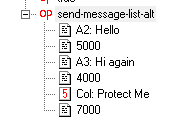
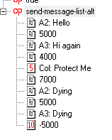
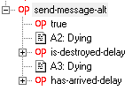

# Send Message Alt Sexps
This adds several sexps to make sending messages half the chore they used to be while adding a host of features to make the whole messaging system many times more powerful. The core of what they can do can be distilled down into two main things. 1) It gets most of the message data from the message itself, so send-message-list-alt takes only two arguments per message rather than four. 2) It has built-in operators to choose between messages based on the ship being present and/or other conditions you may want to set.

For example, you could use set-message-alias to set Alpha 2 alias to A2, Alpha 3 to A3, and Colossus to Col. You can then do a send-message-list-alt like this. Message sender is grabbed from the message name and priority is always Normal. NOTE: Delay here now refers to the current message rather than the previous message's length, which is a change from the built-in send-message-list. So here, A2: Hello has a message length of 5000ms.  

Alternatively, You can have the list automatically choose between ships who are still in the mission. Here, both Alpha 2 and Alpha 3 send a similar message. Alpha 3 has a negative duration which tells the script to pick between it and the previous message with matching duration (in positive). NOTE: The duration does not need to be the same number. A (-) sign notes that the message is an alternate to the previous message.  

Arguably send-message-alt is the most powerful sexp here. It accepts an argument to randomize the choice or do it in order, then it takes a message name followed by a boolean to consider if the message is valid to send. It will consider all of the booleans and if the ships are valid and then choose one message to send. Again, the sender is taken from the message name and the priority is Normal.  

## Sexps included are below. Change -> Messages and Personas

### send-message-alt
A convenience alternative to send-message. This operator is intended to alleviate the annoyance of writing messages from potentially destructible ships. It accepts a list of "message alternatives", each of which can have different conditions during which it might be played. This operator will choose a message who's condition is valid and play it, if any are valid. If a message's source is a ship, then that ship being present is automatically part of its condition, and does not need to be checked manually.
### send-message-list-alt
A convenience alternative to send-message-list. This operator is intended to alleviate the annoyance of writing messages from potentially destructible ships.
### send-message-chain-alt
Like send-message-list-alt, but with a cancellation event like send-message-chain.
### set-message-alias
send-message-alt and related operators use a convention where a message's source is embedded in its message. This operator allows a shorter alias to used for a ship. Note that this operator will not work properly if the ship is not presently in the mission. To register an alias for a non-ship source, use set-freetext-message-alias.
### set-message-freetext-alias
send-message-alt and related operators use a convention where a message's source is embedded in its message. This operator allows a shorter alias to used for a ship.
### get-last-alt-message-source
Write the sender of the last message that was sent with send-message-alt, send-message-list-alt, or send-message-chain-alt. This can be useful to check the result when one of those operators dynamically picks a message. Writes to a string variable.